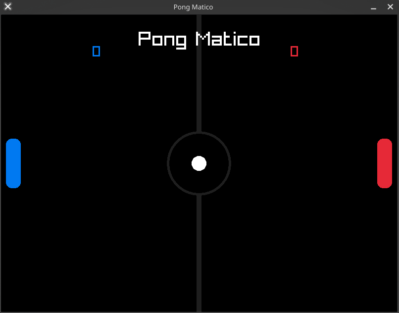

# 🏓 Pong Matico

Un clone di Pong a due giocatori in locale sviluppato in C++ con [Raylib](https://www.raylib.com/).

## Requisiti

- C++17 o superiore
- [Raylib](https://www.raylib.com/) installata

## Compilazione

```bash
g++ main.cpp -o pong -lraylib -lm -lpthread -ldl -lrt -lX11
```

## Come si gioca

Premi **SPAZIO** per lanciare la palla ad inizio partita. Il primo giocatore a raggiungere il punteggio massimo vince.

| Azione | Giocatore SX (blu) | Giocatore DX (rosso) |
|---|---|---|
| Su | `W` | `↑` |
| Giù | `S` | `↓` |

## Struttura del progetto

```
Pong-Matico/
├── main.cpp          # Entry point e game loop
├── MotoreGioco.h     # Logica principale del gioco
├── Palla.h           # Classe palla
└── Pad.h             # Classe pad
```

## Preview del gioco

